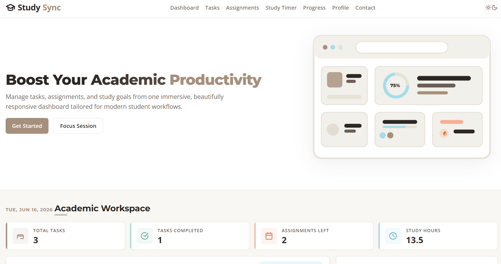
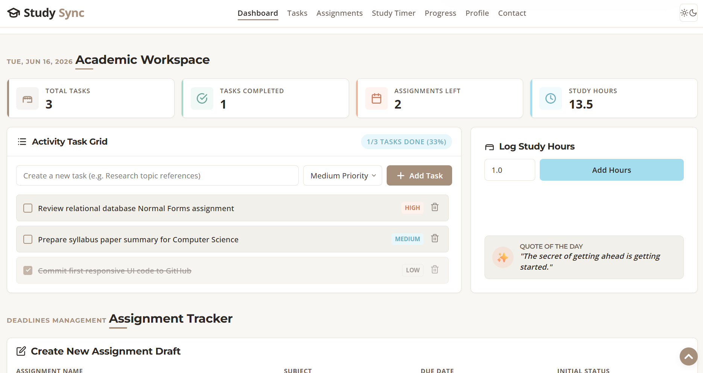
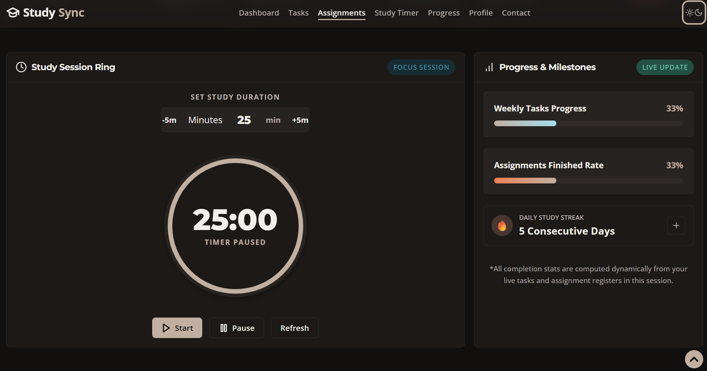

# 🎓 StudySync


A modern and responsive Student Productivity Dashboard designed to help students manage tasks, track assignments, monitor study progress, and stay focused throughout their academic journey.


---


## 🌐 Live Demo


🔗 https://joannablessy157.github.io/StudySync/


---


## 📖 Overview


StudySync provides an all-in-one academic workspace where students can:


- Manage daily tasks efficiently

- Track assignment deadlines

- Use a study timer for focused sessions

- Monitor productivity metrics

- Track study hours and streaks

- Customize their profile

- Switch between Light and Dark themes


Built using pure HTML, CSS, and JavaScript without any external frameworks.


---


## ✨ Features


### 📋 Task Management

- Create new tasks

- Set task priorities

- Mark tasks as completed

- Delete tasks

- Automatic task sorting


### 📝 Assignment Tracker

- Add assignments with due dates

- Track assignment status

- Filter assignments by progress

- Manage deadlines effectively


### ⏱️ Study Timer

- Focus session timer

- Productivity-oriented workflow

- Easy timer controls


### 📊 Progress Dashboard

- Total tasks count

- Completed tasks tracking

- Pending assignments overview

- Study hours monitoring

- Productivity statistics


### 🔥 Study Streak Tracking

- Track consistency

- Monitor academic habits

- Encourage daily progress


### 👤 Student Profile

- Personal information management

- Academic goal tracking

- Course information display


### 🌙 Dark / Light Mode

- Theme switching

- Persistent user preference

- Modern UI experience


### 📱 Responsive Design

- Mobile-friendly layout

- Tablet optimized

- Desktop optimized

- Adaptive navigation system


### ♿ Accessibility

- Semantic HTML structure

- Keyboard navigation support

- ARIA labels

- Skip navigation link

- Focus indicators


---


## 🛠️ Technologies Used


### Frontend

- HTML5

- CSS3

- JavaScript (ES6)


### Design Techniques

- CSS Variables

- Flexbox

- CSS Grid

- Responsive Design

- SVG Graphics


### Storage

- Local Storage API


---


## 📂 Project Structure


```text

StudySync/

│

├── index.html

├── style.css

├── script.js

├── favicon.svg

├── README.md

│

└── screenshots/

```


---


## 🎯 Skills Demonstrated


- Responsive Web Design

- DOM Manipulation

- Event Handling

- State Management

- Local Storage Integration

- Accessibility Best Practices

- CSS Grid & Flexbox

- Theme Management

- Interactive User Interfaces


---


## Getting Started


1. Clone or download the repository.

2. Open `index.html` in your browser.


No additional setup is required.


---


## Screenshots


### Home Page





### Dashboard





### Dark Mode





---


## 🔮 Future Improvements


- User Authentication

- Cloud Database Integration

- Calendar Synchronization

- Notifications & Reminders

- Analytics Dashboard

- Study Session History

- Export Reports

- Drag & Drop Task Management


---


## 👨‍💻 Author


Developed by **Joanna Blessy E**


If you found this project useful, consider giving it a ⭐ on GitHub.


---
